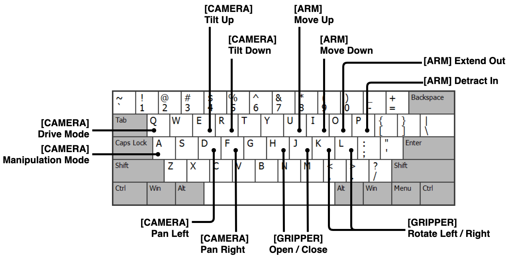
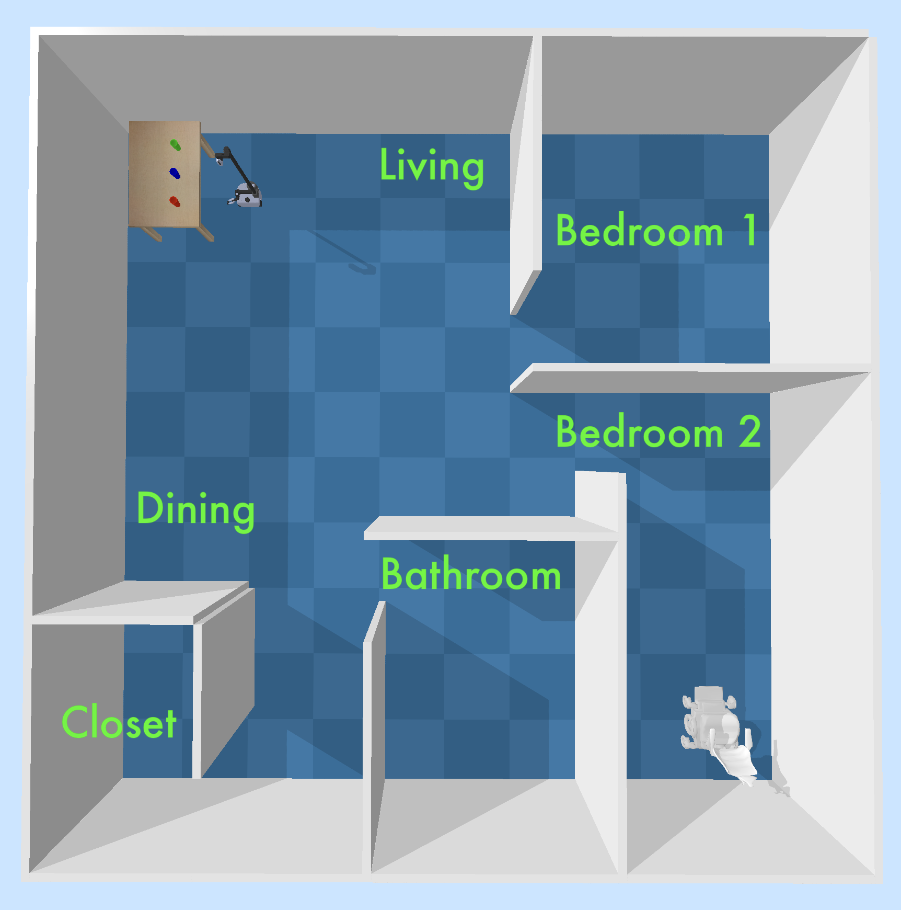
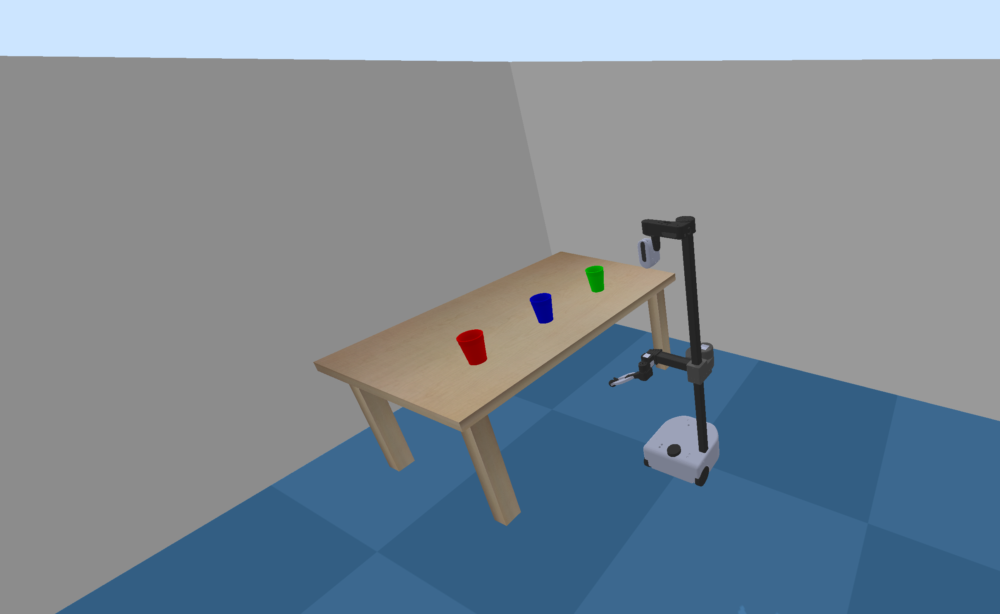
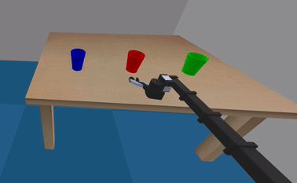

# R2Drink2


## Setup

```
$ pip install -r requirements.txt
```


## Run TeleOp simulation

```
$ python run_teleop.py
```

### CLI

```
$ python run_teleop.py --help
usage: run_teleop.py [-h] [-s SEED] [-g] [-f]

optional arguments:
  -h, --help            show this help message and exit
  -s SEED, --seed SEED
  -g, --gamepad
  -f, --free-view
```

### Keymap

<div align="center">

</div>


# Screenshots

### Floor Plan

<div align="center">

</div>

### Staging Area

<div align="center">

</div>

### Tool View

<div align="center">

</div>